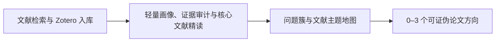

# Zotero & Obsidian Research Skills

[中文](#中文) · [English](#english)

Four portable Codex skills for literature discovery, Zotero management, evidence-bounded hydrology reading, Obsidian research synthesis, and falsifiable paper-direction development.

> Public-release boundary: this repository contains reusable instructions, schemas, templates, validators, and scripts only. It does not contain personal identity or institution details, API keys, Zotero databases, PDFs, private vault content, browser data, cookies, or login credentials.

## 中文

本仓库提供四个可独立安装、也可串联使用的 Codex Skill。整体流程围绕“题录身份可追溯、证据级别不混淆、批次边界可复核、人工判断不被模型替代”设计。



### 四个 Skill

| Skill | 职责 | 主要产出 |
| --- | --- | --- |
| [`zotero-literature-import`](skills/zotero-literature-import/) | 使用 OpenAlex 等权威来源发现文献，透明排序，候选内部去重、Zotero 全库查重，复用已有条目，并在逐篇批准后获取合法开放获取 PDF 或通过 Zotero Connector 入库 | 候选清单、查重审计、逐篇写入计划、Zotero 入库与复核结果 |
| [`zotero-hydrology-notes`](skills/zotero-hydrology-notes/) | 以 Zotero 为题录权威，在正式批次或探索模式下生成可追溯轻量画像、全文覆盖审计、Appendix A.1 核心候选卡和中文精读笔记 | 画像、证据记录、运行/失败/抽检记录、核心候选卡、精读笔记 |
| [`analyze-obsidian-research`](skills/analyze-obsidian-research/) | 读取 manifest、画像、精读笔记、文献 claims、数据、项目和任务，形成 Appendix A.2 科学问题簇、逐篇证据解读和跨簇文献主题地图 | 问题簇 Markdown、关系 JSONL/CSV、主题地图及机器可读节点/边 |
| [`develop-obsidian-paper-ideas`](skills/develop-obsidian-paper-ideas/) | 依据主题地图、问题簇和本地数据/项目/任务证据，筛选零至三个可证伪、可执行的论文方向，并保留导师决策门 | Appendix A.3 Idea 文件、候选 JSONL、`40_选题池/`比较与否决视图 |

职责边界：

- `zotero-hydrology-notes` 停止于文献身份、画像、证据、核心候选和精读笔记，不生成主题地图或论文 Idea。
- `analyze-obsidian-research` 负责问题簇与主题地图，不把关键词共现或方法名称列表当成科学综合。
- `develop-obsidian-paper-ideas` 只接受通过证据门槛的方向；有效结果可以是零个候选，模型不会把候选状态升级为导师确认。
- 所有批次数量都是 manifest 或当前命令中的参数，不使用隐藏的固定样本量。

### 安装

不要只复制 `SKILL.md`。每个 Skill 的 `agents/`、`references/`、`scripts/`，以及存在时的 `evals/` 都是完整运行包的一部分。

方式一：克隆仓库后复制完整目录。

```powershell
git clone https://github.com/<github-account>/zotero-obsidian-research-skills.git
Copy-Item -Recurse .\zotero-obsidian-research-skills\skills\zotero-literature-import "$HOME\.codex\skills\"
Copy-Item -Recurse .\zotero-obsidian-research-skills\skills\zotero-hydrology-notes "$HOME\.codex\skills\"
Copy-Item -Recurse .\zotero-obsidian-research-skills\skills\analyze-obsidian-research "$HOME\.codex\skills\"
Copy-Item -Recurse .\zotero-obsidian-research-skills\skills\develop-obsidian-paper-ideas "$HOME\.codex\skills\"
```

方式二：从 [`packages/`](packages/) 下载需要的 ZIP，解压后将同名完整目录复制到 `.codex/skills/`。

安装或更新后重启 Codex，通过以下名称调用：

```text
$zotero-literature-import
$zotero-hydrology-notes
$analyze-obsidian-research
$develop-obsidian-paper-ideas
```

### 运行环境

- 支持本地 Skill 的 Codex；
- Python 3.10+；
- PowerShell 7+，用于 Obsidian 文件清单辅助脚本；
- Zotero Desktop 与 Zotero Connector，用于两套 Zotero 工作流；
- 可选：llm-for-zotero 或 MinerU 产生的本地 Markdown/全文缓存；
- 可选的配套 Skill：`nature-academic-search`、`nature-ref-verifier`、`nature-writing`、`web-access`、`zotero`。

配套 Skill 未包含在本仓库中；缺少时按各 `SKILL.md` 的降级与停止条件执行。

### OpenAlex 与 Zotero 配置

OpenAlex 检索从进程环境读取 `OPENALEX_API_KEY`。不要把密钥写进 Skill、仓库、命令历史、运行日志或 Codex 对话。

```powershell
[Environment]::SetEnvironmentVariable(
  "OPENALEX_API_KEY",
  "<your-openalex-api-key>",
  "User"
)
```

重新打开 Codex 后再调用相关 Skill。OpenAlex 搜索结果、引用量和来源声望只是候选排序信息，不等同于已验证的影响因子、JCR 分区、SCI/SCIE 收录或论文质量。

Zotero 写入说明：

- Zotero Desktop 本地 API/Connector 通常位于 `127.0.0.1:23119`；
- 复用已同步条目并自动加入 collection 时，可在本机环境配置 `ZOTERO_USER_ID` 和具有适当权限的 `ZOTERO_API_KEY`；
- 普通写入命令默认 dry-run，并要求显式确认；
- 不直接编辑 `zotero.sqlite`；
- 机构访问只能复用用户已有的合法登录会话，Skill 不预设学校，不读取密码、MFA、Cookie 或浏览器令牌。

### 证据与状态约束

- `evidence_status` 表示实际检查到的材料范围，`review_status` 表示人工复核状态，两者不能互相替代；
- metadata、摘要、部分正文、主文全文和全文加补充材料必须明确区分；
- MinerU、OCR、脚本或 LLM 遍历不会自动升级为人工全文核验；
- 摘要或 AI 推断不能写成全文证据；
- DOI、规范化题名、Zotero key、OpenAlex ID 和 `canonical_literature_id` 用于关联同一论文，不重复保存 PDF；
- 正式分析需要唯一 `input_manifest` 与 `source_batch_id`；缺少正式入口时只能输出明确标注的探索性候选结果；
- 论文核心性由相关性、代表性、前沿性、冲突性、证据价值及可核验程度综合判断，期刊层级不是硬门槛。

### 目录说明

```text
skills/
├── zotero-literature-import/
├── zotero-hydrology-notes/
├── analyze-obsidian-research/
└── develop-obsidian-paper-ideas/

packages/
├── zotero-literature-import.zip
├── zotero-hydrology-notes.zip
├── analyze-obsidian-research.zip
└── develop-obsidian-paper-ideas.zip
```

每个 Skill 的详细路由、输入合同、Schema、模板和安全门均在其目录内。参见 [`skills/README.md`](skills/README.md)。

### 安全与版权边界

- 不向公共服务上传本地论文、未公开材料、内部报告、Zotero 文库数据或私人 Obsidian 内容；
- 不绕过付费墙、验证码、授权或机构访问限制；
- PDF 只允许来自明确合法的开放获取、仓储、用户提供或用户已有授权访问；
- OpenAlex 直接 OA 地址是默认路径；任何可能产生费用的缓存内容路径必须单独确认；
- 下载的 PDF 进入 Zotero 或外部暂存目录，不进入 Obsidian 仓库或本 Git 仓库；
- 不自动合并或删除疑似重复 Zotero 条目；
- 不把未核验来源、模型评分或期刊声望冒充科学结论。

### 验证

仓库级检查：

```powershell
python scripts/validate_repo.py
```

两个 Zotero Skill 还提供独立包校验：

```powershell
python skills/zotero-literature-import/scripts/validate_bundle.py
python skills/zotero-hydrology-notes/scripts/validate_bundle.py
```

输出级校验脚本需要按各 Skill 的说明传入 manifest、记录文件和目标输出路径。

## English

This repository contains four portable Codex skills that can run independently or as a staged research workflow:

1. `zotero-literature-import` discovers literature through OpenAlex and other authoritative sources, audits duplicates, and performs guarded Zotero import.
2. `zotero-hydrology-notes` creates traceable profiles, full-text coverage audits, Appendix A.1 core-candidate cards, and evidence-bounded hydrology reading notes.
3. `analyze-obsidian-research` produces Appendix A.2 scientific problem clusters, paper-by-paper interpretations, typed relations, and a literature theme map.
4. `develop-obsidian-paper-ideas` produces zero to three falsifiable Appendix A.3 paper directions and a cross-theme candidate-pool view.

Copy the complete selected folder from `skills/` into `~/.codex/skills/`, or use the matching archive in `packages/`. Do not copy `SKILL.md` alone. Restart Codex and invoke the skill with `$skill-name`.

Requirements include Codex with local Skill support, Python 3.10+, PowerShell 7+ for the vault inventory helper, and Zotero Desktop/Connector for Zotero workflows. OpenAlex access reads `OPENALEX_API_KEY` from the local process environment; no secret belongs in the repository or chat.

The public package contains no private papers, Zotero database, vault content, API key, personal institution, local machine path, browser credential, or login material. Evidence coverage and human review are separate states, and no script or model can promote an output to human-verified or mentor-confirmed status.

Run `python scripts/validate_repo.py` before publishing changes.

## License

MIT. See [LICENSE](LICENSE).
